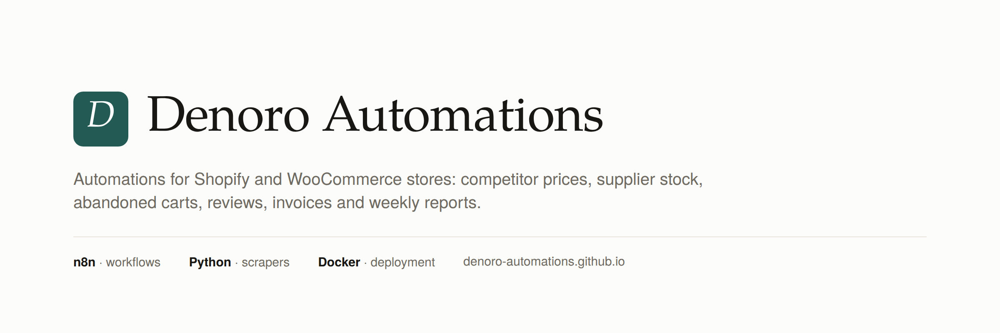

## Hi, we're Denoro Automations 👋

We help **online stores** stop doing repetitive work by hand.

- 📉 **Competitor price monitoring**: scheduled price and stock tracking for Shopify, WooCommerce and any catalogue with readable prices, with full history and CSV export
- 🔔 **Instant alerts** by email, Telegram or Slack when a competitor changes a price
- 📊 **Automated store reports** and catalogue syncs built with n8n

### Demo projects
| Project | What it does |
|---|---|
| [price-monitor](https://github.com/denoro-automations/price-monitor) | Python package + n8n workflows: tracks competitor prices and stock, spots who undercuts you, and sends one summary by email and Telegram. Includes a multi-client panel where each store manages its own links. |
| [weekly-report](https://github.com/denoro-automations/weekly-report) | n8n workflow that emails a weekly sales report every Monday: KPIs against last week, written takeaways, best sellers and stock to reorder, as a PDF. |

### How we work
1. Short written questionnaire about your store
2. Fixed price and delivery date before any work starts
3. Working automation, clear documentation and a short walkthrough of how to use it
4. 2 weeks of free fixes, with optional monthly maintenance

**Tech:** Python · n8n · Docker · Linux · Shopify and WooCommerce APIs · REST APIs

**Site:** https://denoro-automations.github.io/

We only collect public, non-personal data (prices, product details, stock) and respect each site's terms.
